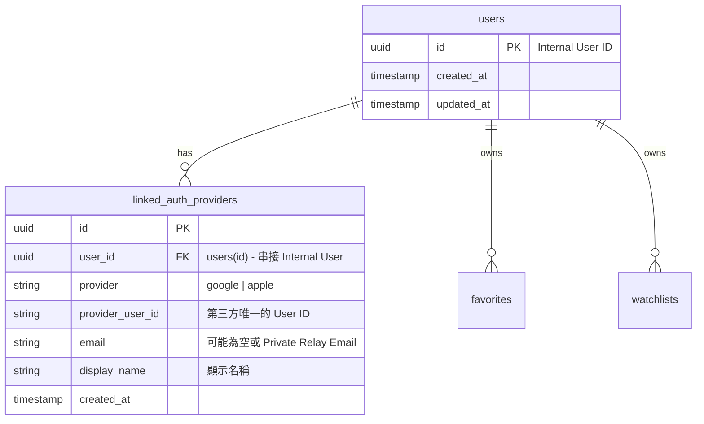
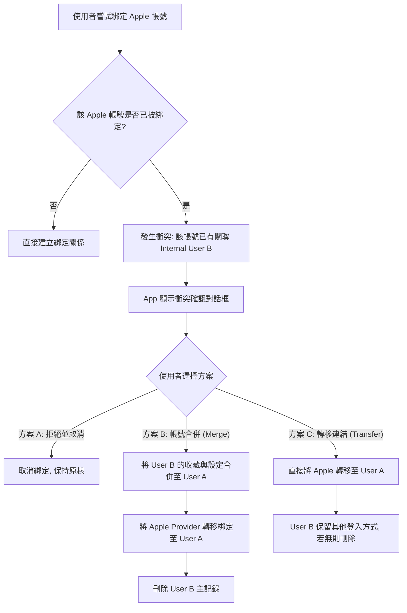

# HoloHunter 共通帳號與多方綁定驗證架構設計 (AUTH Architecture Plan)

本文件針對 HoloHunter App 的共通帳號（不提供自家密碼，支援 Google + Apple 多方帳號綁定）進行架構與實作規劃。

---

## 0. 實作狀態邊界（務必先讀）

> **目前實作（Current Implementation）= 本機模擬 (local mock)。** 現行程式碼**尚未串接任何真實 OAuth、後端資料庫或雲端服務**：
> - `src/store/authStore.ts` 的 `loginWithGoogle` / `loginWithApple` 只寫入**硬編碼的假身份**（固定 email / display name / provider id）到本機 Zustand + 裝置儲存，並非真的向 Google / Apple 驗證。
> - 綁定、解除綁定、衝突合併、`Internal User ID`、tier / quota 全部是**本機狀態切換**，沒有 `users` / `linked_auth_providers` 資料表，也沒有雲端同步。
> - 「刪除帳號」只清除本機 session / 快取；沒有可供刪除的雲端帳號或交易。
>
> **未來目標架構（Future / Target Production）= 以下所有章節。** 本文件第 1 節之後描述的資料模型、DDL、OAuth 流程、衝突處理、後端刪除等，皆為**正式上架時要實作的目標設計，目前尚未實作**。閱讀時請一律視為「未來目標」而非現況。

---

## 1. 資料模型 (Data Model Schema)

為了避免使用 Email 作為唯一身分識別（因 Apple Private Relay 的匿名 Email，以及不同 Provider 註冊的 Email 不一致問題），我們採用 **Internal User ID** 與 **Auth Provider / Identities** 分離的關聯模型。

### A. 實體關係圖 (ERD)



### B. 資料庫欄位定義 (DDL - PostgreSQL/Supabase 示例)

```sql
-- 建立使用者主表
CREATE TABLE users (
    id UUID PRIMARY KEY DEFAULT gen_random_uuid(),
    created_at TIMESTAMP WITH TIME ZONE DEFAULT timezone('utc'::text, now()) NOT NULL,
    updated_at TIMESTAMP WITH TIME ZONE DEFAULT timezone('utc'::text, now()) NOT NULL
);

-- 建立第三方登入關聯表
CREATE TABLE linked_auth_providers (
    id UUID PRIMARY KEY DEFAULT gen_random_uuid(),
    user_id UUID NOT NULL REFERENCES users(id) ON DELETE CASCADE,
    provider VARCHAR(20) NOT NULL, -- 'google' 或 'apple'
    provider_user_id VARCHAR(255) NOT NULL,
    email VARCHAR(255),
    display_name VARCHAR(100),
    created_at TIMESTAMP WITH TIME ZONE DEFAULT timezone('utc'::text, now()) NOT NULL,
    -- 確保同一個第三方 Provider 的使用者帳號在系統中唯一
    UNIQUE (provider, provider_user_id)
);
```

---

## 2. 登入與綁定流程 (Sign-In & Linking Workflows)

### A. 初次登入與註冊
當使用者使用 Google 或 Apple 進行登入時：
1. 後端取得其 `(provider, provider_user_id)`。
2. 查詢 `linked_auth_providers` 表：
   - **若存在**：返回關聯的 `user_id`，載入該使用者的收藏、設定與 Watchlist。
   - **若不存在**：
     1. 建立一個新的 `users` 記錄（生成新的 `internal_user_id`）。
     2. 建立一筆 `linked_auth_providers` 記錄，並將其 `user_id` 指向剛才新建的使用者。
     3. 回傳憑證並建立 Session。

### B. 登入後綁定第二方 (Account Linking)
當使用者已登入（假設目前使用 Google 登入），並在「設定」中點擊「綁定 Apple 帳號」：
1. 觸發 Apple OAuth 流程，取得 Apple 的 `provider_user_id`。
2. 後端查詢 `linked_auth_providers` 中該 `(apple, provider_user_id)` 是否已存在：
   - **狀況 1 (全新帳號)**：該 Apple 帳號未被綁定。後端直接在 `linked_auth_providers` 中新增一筆記錄，`user_id` 設為目前登入的 `internal_user_id`。綁定成功。
   - **狀況 2 (已與目前帳號綁定)**：回傳綁定成功（無須動作）。
   - **狀況 3 (帳號衝突 Collision)**：該 Apple 帳號**已經綁定在另一個 `users` (Internal User B)** 下。

---

## 3. 帳號衝突與合併策略 (Provider Collision Handling)

當發生**狀況 3 (帳號衝突)**時，表示 Google 帳號與 Apple 帳號各自擁有獨立的 `internal_user_id`，且皆有獨立的雲端資料（例如各自有收藏卡牌）。此時需要採取安全的決策流程：



### 推薦實作細節：

1. **方案 A（最安全，預設）**：
   - **行為**：拒絕綁定，並提示使用者：「此 Apple/Google 帳號已綁定至另一個 HoloHunter 帳號。如需綁定，請先登入該帳號並執行『刪除帳號』後再試。」
   - **優點**：絕無資料誤刪或資料覆蓋的法律/客服糾紛，資料庫結構最為單純。
2. **方案 B（帳號合併 - 最佳體驗）**：
   - **行為**：將 User B 的 `favorites`、`watchlists` 中不重複的卡片合併到 User A，並更新 User B 的 `linked_auth_providers` 中關聯至 User A，最後刪除 User B。
   - **優點**：使用者資料不丟失。

---

## 4. 解除綁定 (Unlinking) 與帳號刪除 (Deletion)

### A. 解除綁定 (Unlinking)
- 使用者可在「設定」中針對已綁定的 Provider 進行解除綁定。
- **關鍵安全限制**：
  - **防呆鎖定**：系統必須先查詢 `SELECT COUNT(*) FROM linked_auth_providers WHERE user_id = $1`。
  - **如果數量 = 1**：**拒絕解除綁定**。使用者必須保留至少一個登入管道，以避免帳號成為無人能存取的「孤兒帳號」。
  - **如果數量 > 1**：允許刪除該 Provider 連結。

### B. 帳號刪除 (Account Deletion)

> **實作狀態（重要）**：以下為**正式上架後**規劃的後端刪除流程，尚未實作。**目前版本（本機模擬）**中，App 並沒有任何雲端帳號或資料——所有資料只存在裝置本機。App 內的「刪除帳號（本機）」會清除本機 Session、收藏清單 (`watchlistStore`) 與掃描卡牌暫存 (`scanSessionStore`) 並登出，這已完整刪除本 App 目前持有的全部資料，**目前沒有任何雲端資料需要刪除**。**以電子郵件申請 / 後端人工處理的雲端資料刪除管道，屬於未來正式版（串接真實後端與金流後）才會提供的功能**（與 `public/privacy.html`、`public/support.html` 中標示為「未來正式版」的說明一致）。下方流程為串接真實後端後的目標行為。

規劃中（正式版目標）：符合 Apple App Store 與 Google Play 的合規要求，當使用者在 App 內執行「刪除帳號」，後端將：
1. 刪除該使用者的 `users` 記錄（由於外鍵設為 `ON DELETE CASCADE`，會自動刪除所有關聯的 `linked_auth_providers`）。
2. 同步刪除該使用者在雲端資料庫中的所有 `favorites`、`watchlists`、`settings` 及推播 `push_tokens`。

---

## 5. 多平台支援矩陣與 Apple Developer 設定

### A. 平台支援矩陣

| 平台 | Google 登入 | Apple 登入 | 說明 |
|---|---|---|---|
| **Web** | ✅ 支援 (首選) | ⚠️ 技術可行 (Supabase/Firebase Web OAuth) | Apple 登入需要設定 Web Apple Client |
| **iOS** | ✅ 支援 | ✅ 支援 (首選) | 依 Apple 審查規範：有 Google 登入就必須同時提供 Sign in with Apple |
| **Android** | ✅ 支援 (首選) | ❌ 評估中 (低優先) | Android 上若要 Apple 登入，需透過 Web-based OAuth 流轉，體驗較差 |

### B. Web Apple 登入設定指南 (Firebase / Supabase)

若要在 Web 上實現 Apple 登入，開發者必須在 Apple Developer 帳號中設定以下項目：

1. **App ID 與 Sign In with Apple 啟用**：
   - 在 Apple Developer 帳號中的 Identifiers，確保對應的 App ID 啟用了 **Sign In with Apple**。
2. **建立 Services ID (Web Client)**：
   - 在 Identifiers 新增一個 **Services ID** (例如 `com.dicoge.holohunter.web`)。
   - 啟用 **Sign In with Apple** 並點擊 **Configure**。
   - 關聯至上述的 App ID。
3. **設定 Domains and URLs**：
   - **Domains**：填寫網站域名 (例如 `card-hunter-mu.vercel.app`)。
   - **Return URLs (Redirect URI)**：填寫驗證平台的 Callback 網址。
     - *Supabase 範例*：`https://<project-id>.supabase.co/auth/v1/callback`
     - *Firebase 範例*：`https://<project-id>.firebaseapp.com/__/auth/handler`
4. **產生 Sign in with Apple Private Key (`.p8` 密鑰)**：
   - 在 Apple Keys 頁面建立一個專用 Key，下載 `.p8` 密鑰檔案。
   - 取得 **Key ID** 與 **Team ID**。
5. **填入第三方平台**：
   - 將下載的 `.p8` 檔案內容、Services ID (作為 Client ID)、Team ID、Key ID 填入 Firebase / Supabase Console 的 Apple Provider 設定中。

---

## 6. QA 測試與品質保證計畫 (QA Test Plan)

### A. 功能性測試案例 (Functional Test Cases)

| ID | 測試場景 | 預期結果 |
|---|---|---|
| **TC-01** | 單一 Google 登入後綁定 Apple 成功 | 帳號資訊顯示同時綁定 Google 與 Apple，資料庫中一個 `user_id` 對應兩筆 Provider 記錄。 |
| **TC-02** | 單一 Apple 登入後綁定 Google 成功 | 同上，一個 `user_id` 綁定兩筆記錄。 |
| **TC-03** | 嘗試解除綁定唯一的 Provider | App 阻擋解除，提示「必須保留至少一種登入方式以維護帳號存取」。 |
| **TC-04** | 雙綁定帳號解綁其中之一 | 解綁成功，剩餘的一方仍可正常登入並讀取相同 `user_id` 的資料。 |
| **TC-05** | 帳號衝突 - Google 綁定已被其他 User B 綁定的 Apple 帳號 (選擇方案 A - 取消) | 綁定取消，兩者資料皆不受影響，保持獨立。 |
| **TC-06** | 帳號衝突 - 選擇合併資料 (方案 B) | User B 的收藏合併到 User A，Apple 轉綁至 User A，User B 帳號刪除。 |
| **TC-07** | 刪除帳號 (Account Deletion) | `users` 與對應的 `linked_auth_providers` 及收藏資料全部被清空，該 Google/Apple 帳號再次登入時會被視為全新註冊。 |
| **TC-08** | Apple Private Relay 登入測試 | 即使 Apple 隱藏真實 Email，仍可透過 Provider User ID (Apple Sub) 正確登入與綁定，不受 Email 變動影響。 |
