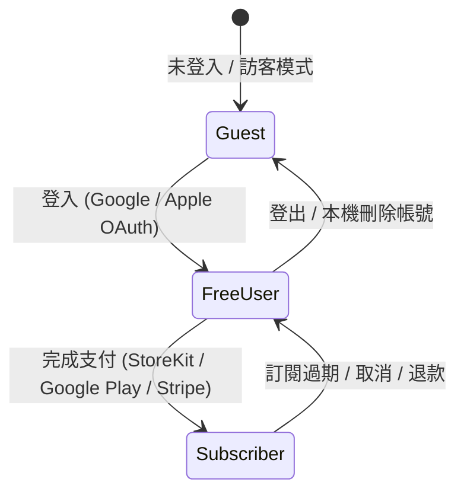

# HoloHunter 商業化準備與 Store Readiness 技術規範草案 (DIC-1157 Technical Specification)

> **版本**：1.2.0 (工程審核草案 / Engineering Review Draft)  
> **日期**：2026-08-25  
> **專案**：HoloHunter (hunterCard)  
> **識別碼**：DIC-1157  
> **網域規範**：Canonical 正式網域 `https://holohunter.dicoge.com/`（舊 Vercel URL 禁止）

---

## 0. 核心原則與外部發布門檻 (Core Principles & External Launch Gates)

> [!IMPORTANT]
> **外部發布與未來審核門檻聲明 (External/Future Gate Disclaimer)**  
> 本文件與程式碼提供 P0 商業化、法律條款架構、廣告版位元件與三端支付狀態機之**工程基礎設施與沙盒草案 (Engineering Scaffolding & Draft Framework)**。  
> 以下項目屬於**外部發布與未來產品／法務審核門檻 (External/Future Launch Gates Example/TBD)**，尚未在當前 PR 中宣稱完全上線（Production）或為正式產品事實：
> 1. 三端真實 Merchant 帳號與銀行／稅務／2FA 開通（需由團隊與產品負責人操作）。
> 2. 正式 Production SKU 建立與價格核可（未經產品負責人確認簽字前嚴禁硬編碼或宣稱正式價格）。
> 3. Store Review 審查員 Demo 帳號、真實自動續訂扣款與退款機制（現階段為規劃中未來門檻）。
> 4. 地理區域 CMP / Privacy Policy 最終法務確認。
> 5. 正式收款與廣告流量開關（預設為關閉狀態 `PRODUCTION_ADS_ENABLED = false`）。

1. **三端支付與結帳通道邊界**：
   - **Web 數位訂閱**：規劃使用 Stripe Test Mode / RevenueCat Web Billing 對接 Stripe，正式上架（Production）前需完成商戶審核。
   - **iOS / Android App 內數位功能**：iOS 規劃使用 Apple StoreKit 2；Android 規劃使用 Google Play Billing。**嚴禁在 App 內提供連線至 Web 結帳之引導或連結**（遵循 App Store 3.1.1 與 Google Play 政策）。
2. **跨平台 Entitlement 同步**：
   - 依據 DIC-1148 / DIC-1149 entitlement 規劃，跨平台權益必須經過後端憑證與收據對帳，**禁止僅憑 Client 端 Boolean 狀態作為授權依據**。
3. **無發明價格與動態 API 載入**：
   - 方案價格一律由平台/Stripe Product API 動態帶入，禁止在 Sandbox/Pricing 頁面將未確認之金額宣稱為產品事實。

---

## 1. Section A: Pricing 頁面與方案架構規範

### 1.1 公開與爬蟲存取 (Public & Crawlable)
- **公開網址**：`https://holohunter.dicoge.com/pricing.html`（rewrite 映射 `/pricing`）。
- **SEO & 語系支援**：公開可被搜尋引擎 Crawl，具備 `<link rel="canonical" href="https://holohunter.dicoge.com/pricing.html">`，並提供多語系切換（繁體中文 `zh-Hant` / 日本語 `ja` / 英文 `en`）。
- **無 JS 可讀性**：內建 `<noscript>` 樣式區塊，即使停用 JavaScript，日文與英文內容仍可直接閱讀。

### 1.2 方案權益與沙盒草案狀態 (Plan Matrix & Sandbox Draft Status)

| 權益項目 | Free 免費版 | Pro 月費方案 (Sandbox 範例) | Pro 年費方案 (Sandbox 範例) |
|---|---|---|---|
| **顯示金額** | **NT$ 0 / ¥0 / $0** | **待 Store API 動態載入 (TBD)** | **待 Store API 動態載入 (TBD)** |
| **沙盒產品識別碼範例** | N/A | `pro.monthly.sandbox` (TBD 範例) | `pro.yearly.sandbox` (TBD 範例) |
| **卡牌資料庫與手動搜尋** | ✅ 完整開放 | ✅ 完整開放 | ✅ 完整開放 |
| **賽事牌型與組牌分析** | ✅ 完整開放 | ✅ 完整開放 | ✅ 完整開放 |
| **相機辨識 (OCR) 配額** | 📊 每月上限 100 次 | ♾️ **無限次數** | ♾️ **無限次數** |
| **AI 價格趨勢預測與警報** | ❌ 鎖定 | ✅ 完整解鎖 | ✅ 完整解鎖 |
| **廣告體驗** | 低干擾測試廣告 | 🚫 **純淨無廣告** | 🚫 **純淨無廣告** |

### 1.3 條款與管理入口說明 (TBD / 規劃中門檻)
Pricing 頁面隨附以下草案與說明連結：
- 訂閱管理與關閉自動續訂說明 (規劃中未來門檻)
- 恢復購買 (Restore Purchases) 指引 (規劃中未來門檻)
- 退款政策 (Refund Policy) 入口 (規劃中未來門檻)
- 技術支援與聯絡信箱 (`dicoge.chen@gmail.com`)
- 服務條款草案 (`/terms`) 與隱私權政策 (`/privacy`) 連結

---

## 2. Section B: 法律／審核頁面草案規範

### 2.1 頁面結構與 Canonical 網域
維護四個標準前端合規頁面（均標示【工程審核草案】）：
1. `https://holohunter.dicoge.com/pricing.html` (`/pricing`)
2. `https://holohunter.dicoge.com/terms.html` (`/terms`)
3. `https://holohunter.dicoge.com/privacy.html` (`/privacy`)
4. `https://holohunter.dicoge.com/support.html` (`/support`)

### 2.2 必備揭露條款 (Mandatory Disclosures)
- **非官方工具與免責聲明**：
  > 「HoloHunter 是一款專為 hololive OFFICIAL CARD GAME 玩家設計之非官方卡牌價格查詢與賽事分析工具，與 Cover 株式會社 (Cover Corp.) 無任何官方關聯、授權或代言關係。卡牌名稱與相關圖像著作權均歸 Cover 株式會社所有。」
- **資料來源與 API**：
  - 卡牌市場價格索引自遊々亭 (Yuyu-tei) 等公開市場。
  - 社群熱度數據對接 YouTube Data API。
  - 網頁版卡牌相機辨識透過 OpenRouter / Google Gemini 視覺模型處理。
- **付款處理商揭露**：明列交易將由 Apple StoreKit 2、Google Play Billing 與 Stripe 處理，App 本身不儲存亦不經手任何信用卡號或財務敏感資料。
- **帳號與資料刪除草案**：
  - 本機資料清理可直接在 App 內「設定」操作。
  - 雲端帳號及 OAuth 綁定紀錄可寄至 `dicoge.chen@gmail.com` 手動申請刪除。

---

## 3. Section C: 廣告版位架構 (AdSlot Architecture)

### 3.1 AdSlot 元件與安全規範 (`src/components/AdSlot.tsx`)
- **正式流量預設關閉**：`PRODUCTION_ADS_ENABLED = false`。
- **Fail-Closed 嚴格授權門檻 (DIC-1157 CR Blocker 1)**：
  - `serverValidatedRole` 未傳入 (undefined/null) 或為 unverified 狀態時，**強制 fail-closed 回傳 `null`**。
  - 絕不降級信任 Client 端的 `authStore.role` 記憶體／持久化狀態。
  - 僅當傳入顯式後端驗證權益 `serverValidatedRole === 'free_user' | 'guest'` 且 `hasConsent === true` 時，方可顯示測試版位。
- **Pro Entitlement 隱藏**：`serverValidatedRole === 'subscriber'` 時直接回傳 `null`。
- **Real Error Boundary 類別元件**：使用 `AdSlotErrorBoundary` 包覆，任何渲染錯誤均靜默降級回傳 `null`，絕不安裝或阻塞 App 運行。

---

## 4. Section D: 三端支付與 Store Readiness 規劃指南 (TBD / Development Examples)

### 4.1 Proposed Provider-Neutral State Machine (規劃中狀態機草案)
跨平台訂閱狀態機流程規範：

### 4.2 SKU Naming & Catalog 測試範例 (Development Naming Examples — Catalog TBD)
- **Sandbox Catalog Naming Examples**:
  - iOS Product ID: `com.dicoge.holohunter.pro.monthly.sandbox` (TBD 範例)
  - Android Product ID: `holohunter_pro_monthly_sandbox` (TBD 範例)
  - Stripe Price ID: `price_1P_test_monthly_sandbox` (TBD 範例)
- **管制 Invariant**：未經產品負責人確認簽字前，禁止建立正式 Production SKU。

---

## 5. 驗收核對清單 (Acceptance Criteria Status)

- [x] **公開 Initial HTML 可讀 & No-JS 支援**：`pricing.html`, `terms.html`, `privacy.html`, `support.html` 具備 `<main>`, `<h1>`, `<link rel="canonical">`, `<noscript>` 降級區塊與草案標示。
- [x] **無硬編碼價格**：Pricing 頁面標示價格由 Store/Stripe API 動態帶入。
- [x] **舊 Vercel URL 清除**：全站使用 canonical `https://holohunter.dicoge.com/`。
- [x] **AdSlot 安全合規與單元測試**：`src/components/AdSlot.tsx` 正式流量預設關閉、具備 `AdSlotErrorBoundary` 與 Server-validated role fail-closed 邏輯，單元與渲染測試（`scripts/test-adslot-render.mjs`）全數通過。
- [x] **Isolated Dist Audit & Mutation Testing**：`scripts/test-dist-nojs.mjs` 針對 `dist/` 輸出產物進行實機與變異測試（Mutation testing），經註冊於 `package.json`（`npm run test:dist-nojs`）通過。
- [x] **外部 Gate 明確標示**：Production SKU、Merchant 開通與真實自動續訂扣款全數標示為外部/未來發布門檻與 TBD 範例。
