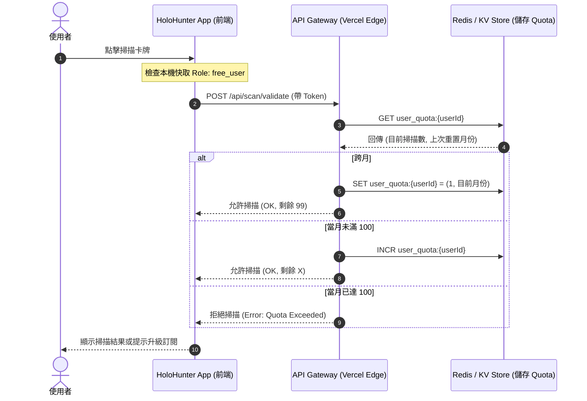

# HoloHunter 營利模式、權限控管與 Onboarding 架構設計 (Monetization Architecture Plan)

本文件規劃 HoloHunter App 後續上架之付費訂閱、訪客限制、每月掃描配額 (Quota) 防竄改設計，以及刪除帳號時的資料庫清理策略。

---

## 0. 實作狀態邊界（務必先讀）Current Implementation vs. Future Target

> **目前實作（Current Implementation）= 本機模擬 (local mock)。**
> 現行 App 版本並未串接任何後端、金流或伺服器端配額服務。實際行為如下：
> - **角色切換**：`guest` / `free_user` / `subscriber` 皆為 `src/store/authStore.ts` 內的本機 Zustand 狀態。「模擬升級訂閱」只是把 `role` 在本機由 `free_user` 翻成 `subscriber`，沒有 StoreKit、Google Play Billing 或 Stripe 交易，也沒有收據驗證。
> - **掃描配額**：`scanCount` 為本機儲存的假數值，遞減與「100 次上限」判斷全在裝置端進行。沒有 Redis / KV、沒有 `/api/scan/validate`、沒有伺服器端 `INCR`，因此可被清除快取或重裝 App 重置——**目前並非防竄改**。
> - **登入**：`loginWithGoogle` / `loginWithApple` 只寫入寫死的假帳號到本機，並非真正的 Google / Apple OAuth，也沒有 `users` / `linked_auth_providers` 資料表。
> - **刪除帳號**：只清除本機 session 與快取；雲端沒有帳號、配額或交易紀錄可刪。
>
> **未來目標架構（Future / Target Production）= 以下第 1 節起的所有內容。**
> 下方的權限矩陣、Onboarding 與 OAuth 註冊、伺服器端 Quota 防竄改 (Redis/KV)、StoreKit 2 / Google Play Billing / Stripe 訂閱同步、後端帳號刪除與資料清理流程，**皆為尚未實作的目標設計 (target architecture)**，需在正式串接後端與金流時才會落地。閱讀時請以「規劃藍圖」看待，勿誤認為現有功能。

---

## 1. 權限與營利矩陣 (Permissions Matrix)

我們設計了三種使用者角色：`guest` (訪客)、`free_user` (免費登入者)、`subscriber` (付費訂閱者)。

| 功能區塊 | 訪客模式 (guest) | 免費登入者 (free_user) | 付費訂閱者 (subscriber) |
|---|---|---|---|
| **瀏覽規則 / 搜尋卡牌** | ✅ 允許 | ✅ 允許 | ✅ 允許 |
| **卡牌掃描 (相機 OCR)** | ❌ 拒絕 (提示登入) | 📊 每月上限 100 張 | ♾️ 無限制 |
| **價格趨勢預測** | ❌ 鎖定 (Padlock 提示) | ❌ 鎖定 (Padlock 提示) | ✅ 完整解鎖 (Premium) |
| **進階市場分析數據** | ❌ 鎖定 | ❌ 鎖定 | ✅ 完整解鎖 (Premium) |

---

## 2. Onboarding 與註冊登入流程 (Onboarding Flow)

在 App 啟動或使用者進入「設定」分頁時：
1. **首次開啟**：App 提供 "Sign in with Google / Apple" 以及 "Continue as Guest (以訪客身分繼續)" 兩個入口。
2. **訪客入口**：點擊後 `role` 設為 `guest`，無須登入即可進入首頁。首頁及設定頁會常駐「登入以開啟掃描」的引導 CTA。
3. **登入註冊**：一律採用安全 OAuth 第三方登入，成功後建立帳號並在資料庫將其預設為 `free_user`。

---

## 3. 每月掃描配額防竄改設計 (Scan Quota Security)

為避免使用者透過修改本地時間或清除 App 暫存來竄改每月 100 次的免費掃描次數，系統架構設計如下：

### 防竄改核心要素：
* **Server-side 憑證**：每次掃描發起時，後端驗證 Session JWT，並在 Redis 中將當月掃描計數 `INCR`。
* **重置週期**：以協調世界時 (UTC) 每月 1 號 00:00 自動重置使用者的 quota 數值。

---

## 4. 訂閱狀態同步 (Subscription Syncing - IAP & Stripe)

訂閱狀態的管理採用第三方 Billing Gateway 與後端 Webhook 同步：

1. **iOS / Android App 端**：
   - 採用 **StoreKit 2** (iOS) 與 **Google Play Billing** (Android) 進行交易。
   - 交易完成後，取得 App Store / Google Play 的加密 Receipt (收據)。
   - 送至後端 `/api/subscription/verify`，向 Apple/Google 伺服器驗證，並在後端將 `linked_auth_providers` 對應的 `users.role` 改為 `subscriber`。
   - 監聽 Apple App Store Server Notifications / Google Developer Notifications Webhook，自動處理訂閱過期、取消、退款等狀態變更。
2. **Web 網頁版**：
   - 使用 **Stripe Checkout**。
   - 監聽 `stripe-webhook` (`customer.subscription.created` / `deleted`)，同步更新 `users.role`。

---

## 5. 隱私權政策與資料刪除遵循 (Compliance & Account Deletion)

### A. 隱私權政策應載明項目
當引入訂閱與配額管理後，隱私權政策必須補充收集以下資料：
* **使用量紀錄**：收集並記錄您的每月卡牌掃描次數，僅用於防範系統濫用與提供免費版額度限制。
* **交易資訊**：當您購買訂閱時，我們僅收集交易收據代碼 (Transaction ID) 用於啟用訂閱。您的信用卡號、帳單地址等敏感財務資訊均由 Apple Pay、Google Pay、Stripe 處理，本 App 絕不經手。

### B. 帳號刪除之清理政策 (Data Purge)

> **實作狀態（重要）**：以下為**正式上架、串接後端與金流後**的規劃清理流程，尚未實作。**目前版本（本機模擬）**並沒有任何雲端資料、配額或訂閱關聯——所有資料只存在裝置本機。App 內的「刪除帳號（本機）」會清除本機 Session、收藏清單與掃描卡牌暫存並登出，這已完整刪除本 App 目前持有的全部資料，**目前沒有任何雲端資料需要刪除**。**以電子郵件申請 / 後端人工處理刪除雲端資料、配額與訂閱關聯的管道，屬於未來正式版才會提供的功能**（與 `public/privacy.html`、`public/support.html` 中標示為「未來正式版」的說明一致）。

規劃中（正式版目標）：當使用者點擊「刪除帳號」時，為了符合 GDPR 與商店資料安全規範，後端將執行以下流程：
1. **關聯性抹除**：刪除 `users` 表，透過級聯刪除 (Cascade Delete) 刪除其 `linked_auth_providers` 紀錄。
2. **使用量清除**：刪除 Redis / 關係資料庫中的 `user_quota:{userId}` 掃描次數紀錄。
3. **金流交易匿名化**：將該使用者的交易紀錄（如 Transaction ID / Stripe Customer ID）與其 `internal_user_id` 的關聯切斷，並將訂閱對應狀態改為「已註銷」，防止交易紀錄反向追蹤至個人，同時保留財稅申報所需的去識別化交易數據。

---

## 6. QA 測試計畫 (QA Test Plan for Monetization)

| 測試案例 ID | 測試場景 | 測試角色 | 步驟 | 預期結果 |
|---|---|---|---|---|
| **TC-MON-01** | 訪客模式功能限制測試 | `guest` | 1. 啟動 Onboarding 選擇訪客模式。 2. 點擊「掃描」與「趨勢預測」。 | 1. 首頁/設定頁引導登入。 2. 掃描彈出「請先登入」提示。 3. 預測圖表模糊且帶有鎖頭，提示升級。 |
| **TC-MON-02** | 免費版掃描額度與遞減測試 | `free_user` | 1. 以 Google/Apple 登入。 2. 執行卡牌掃描。 | 1. 掃描成功。 2. 掃描頁面 badge 顯示「免費版剩餘額度: 99/100」。 |
| **TC-MON-03** | 免費版額度上限阻擋測試 | `free_user` | 1. 將資料庫/Zustand 的 `scanCount` 改為 100。 2. 點擊掃描。 | 1. 相機關閉或顯示遮罩。 2. 顯示「已達本月上限 100 次，請升級訂閱」及 CTA 按鈕。 |
| **TC-MON-04** | 免費版解鎖付費功能測試 | `free_user` | 1. 進入卡牌詳情頁。 2. 點擊趨勢分析。 | 1. 預測區塊顯示鎖頭，背景模糊。 2. 點擊鎖頭跳出「升級訂閱以解鎖」對話框。 |
| **TC-MON-05** | 訂閱版無限制掃描與解鎖測試 | `subscriber` | 1. 登入並模擬升級至訂閱。 2. 執行掃描與查看趨勢。 | 1. 掃描頁顯示「訂閱版 (無限次數)」。 2. 趨勢預測圖表解鎖，無鎖頭或模糊。 |
| **TC-MON-06** | 刪除帳號併清空 Quota 測試 | `free_user` | 1. 進行幾次掃描後，至設定頁點擊「刪除帳號」。 2. 重新以同帳號註冊登入。 | 1. 刪除完成後 Session 清空。 2. 重建帳號後，發現舊卡牌收藏消失，每月 Quota 重置回 0/100。 |
