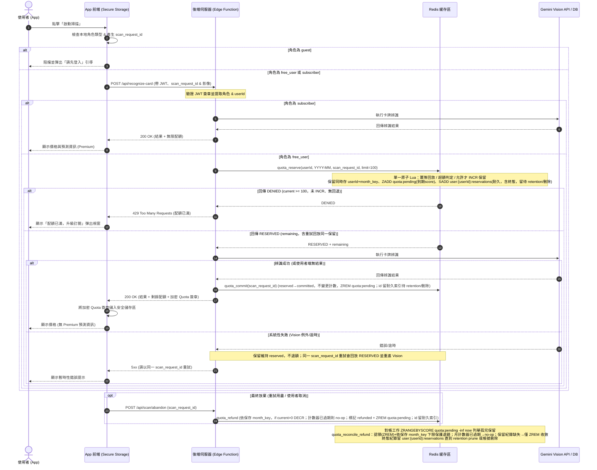

# HoloHunter 首頁入口、權限模型與每月掃描 Quota 設計方案

本文件規劃為 HoloHunter (hOCG 卡牌查價 App) 設計 Onboarding 流程、權限防護模型 (guest / free_user / subscriber)、安全防竄改掃描配額機制、應用程式商店訂閱金流與隱私合規之完整架構。

---

## 🏗️ 1. 系統架構與流程圖

HoloHunter 的核心原則為**客戶端僅負責 UI 呈現與手勢操作，權限判定與 Quota 控制皆由伺服器端 (Server-side) 進行最終把關**。

### 1.1 使用者 Onboarding 與角色切換流程


### 1.2 掃描請求與防竄改配額驗證流程

由於卡牌辨識（OCR/Gemini Vision API）是線上服務，所有掃描請求都必須通過後端 API。這使得配額控制可以完全由伺服器防禦，防止用戶修改本地時間或快取。



---

## 🔐 2. 權限防護模型 (Role-Based Access Control)

系統區分為三種角色，權限矩陣如下：

| 功能項目 | 訪客 (guest) | 免費登入用戶 (free_user) | 訂閱用戶 (subscriber) |
| :--- | :---: | :---: | :---: |
| **卡片搜尋與篩選** | ✅ 允許 | ✅ 允許 | ✅ 允許 |
| **官方規則查閱** | ✅ 允許 | ✅ 允許 | ✅ 允許 |
| **基本市場價格顯示** | ✅ 允許 | ✅ 允許 | ✅ 允許 |
| **卡片詳情頁** | ✅ 允許 | ✅ 允許 | ✅ 允許 |
| **卡片相機掃描** | ❌ 拒絕 (彈出登入引導) | ✅ 每月上限 100 張 | ✅ 無限次數 |
| **價格預測 (Premium)** | ❌ 隱藏 (顯示升級鎖) | ❌ 隱藏 (顯示升級鎖) | ✅ 完整解鎖 |
| **趨勢預測 (Premium)** | ❌ 隱藏 (顯示升級鎖) | ❌ 隱藏 (顯示升級鎖) | ✅ 完整解鎖 |
| **進階市場數據與提醒** | ❌ 拒絕 | ❌ 拒絕 | ✅ 完整解鎖 |

---

## 🛡️ 3. 每月掃描 Quota 防竄改機制 (Anti-Tampering Engine)

為了完全避免使用者透過竄改本機 App 狀態或修改手機系統時間來規避 100 次的掃描上限，本架構採取**雙重安全保護機制**：

### 3.1 伺服器主控配額管理 (Server-Centric Control)
1. **無離線掃描支援**：由於 OCR 與 Gemini Vision 圖像識別服務需要連線到伺服器處理，後端將作為配額審查的唯一真理來源 (Source of Truth)。
2. **Redis 週期性計數器**：
   - 當月次數以 `user:{userId}:scans:{YYYY-MM}` 為 Redis Key 累計；其增量**一律經由 §3.3 的 `quota_reserve` 原子契約在確認未達上限時發生**，後端不在收到請求時先行裸 `INCR`。
   - 該 Key 設定過期時間為當月最後一天的 23:59:59 (基於伺服器 UTC 時間)，下月自動重置為 0。
   - **計數器過期後的退額為 no-op**：任何遲來的退額（放棄或對帳）只對保留紀錄保存的原始 `month_key` 計數器動作，且採下限保護（`if current > 0 then DECR`）；若該月計數器已過期消失，退額不重建鍵、不遞減，避免產生 `-1` 負值或污染新月計數（細節見 §3.3 第 5、6 點）。
3. **時鐘防禦 (Clock Attack Prevention)**：不依賴手機端時間判定月份，完全以伺服器端接收請求的時間戳記進行統計。

### 3.2 本地安全防護同步 (Local Security Storage)
1. **加密儲存**：
   - **Android**：參考 `AIQuotaWatch` 的安全實作，使用 AES-256 的 `EncryptedSharedPreferences` 配合 Android Keystore 進行 Token 與剩餘 Quota 資料的儲存。
   - **iOS**：使用 iOS Keychain 來儲存登入憑證與 Quota Meta。
2. **加密防篡改簽章 (Cryptographic Quota Signature)**：
   - 伺服器回傳 Quota 剩餘數量時，會額外附帶一個 HMAC 簽名：
     $$\text{Signature} = \text{HMAC-SHA256}(\text{Server-Private-Key}, \text{userId} + \text{remainingScans} + \text{expireTimestamp})$$
   - 當 App 每次載入時，會讀取本地快取並驗證簽章；若發現簽名不符或過期，App 會強制與後端 API `/api/user/sync-quota` 同步以取得最新資料。

### 3.3 扣額原子語意、冪等與失敗處理 (Atomicity / Idempotency / Fail-closed)

配額扣減必須是原子的，且在逾時、辨識失敗、重試等狀況下**不重複扣額也不漏扣**。核心是**單一伺服器端原子契約**：一個 Redis Lua script（在 Redis 內單執行緒不可分割地執行）同時完成「檢查上限 + 記錄冪等/保留狀態 + 僅在允許時保留額度」。**不存在**「先 `INCR` 再比對、超額才 `DECR` 回退」這種以多個獨立指令拼湊而被視為原子的作法。

1. **唯一保留契約 `quota_reserve`（單一原子 Lua script）**
   輸入：`userId`、`month_key = YYYY-MM`（伺服器 UTC 決定）、`scan_request_id`、`limit = 100`。在同一次 script 執行內依序判斷並回傳，全程原子：
   - **(a) 冪等回放**：若 `reservation:{scan_request_id}` 已存在，依其狀態原子回放、**不再變更計數**——這是重試的唯一正確路徑：
     - `reserved` → 回 `RESERVED`＋當時 remaining，呼叫端**重進 Vision**（保留在重試間持續持有，見下方 2）。
     - `committed` → 回終態 `COMMITTED`（已落定，回放前次結果）。
     - `refunded` → 回終態 `REFUNDED`（已於最終放棄時退額，不可再取得 `RESERVED`、不再進 Vision）。
     - `denied` → 回 `DENIED`。
   - **(b) 超額判定**：否則讀取 `user:{userId}:scans:{month_key}` 目前值；若 `current >= limit`，寫入 `reservation:{scan_request_id} = denied` 後回傳 `DENIED`——**此路徑完全不對計數器做 `INCR`，因此不需要、也不會有任何 `DECR` 回退**。
   - **(c) 允許才保留**：否則對計數器 `INCR`（此 `INCR` 只在確認未達上限後於同一 script 內發生），並在**同一 script 內**：
     - 寫入耐久保留紀錄 `reservation:{scan_request_id} = { state=reserved, userId, month_key, remaining }`——**明確保存 `userId` 與 `month_key`**，退額時不需再依賴任何會過期的鍵去推斷歸屬月份。
     - 將該 id 登記進**耐久且可列舉的全域待決索引** `quota:pending`（Redis Sorted Set，score = 保留到期 deadline 的 epoch 秒，member = `scan_request_id`）。
     - 同時 `SADD user:{userId}:reservations {scan_request_id}`——**每位使用者一份耐久且可列舉的保留索引，涵蓋該用戶「待決 + 已終態（committed/refunded）」的所有 `scan_request_id`**。此索引在終態轉移時**不**移除，一路保留到「保留紀錄 retention 清理」或「帳號刪除」為止，使刪除能列舉並清除全部（含終態）保留紀錄（見 §6.1、下方 retention 說明）。
     回傳 `RESERVED` 與 remaining。
   計數器 Key 首次建立時設定過期為當月最後一刻（承 §3.1）。**保留紀錄 `reservation:{scan_request_id}` 不設會令對帳或刪除失去 `userId`/`month_key` 的短 TTL**。
   - **兩索引職責不同、生命週期刻意不一致**：`quota:pending`（Sorted Set）只含**待決**保留，是對帳「哪些尚待落定」的唯一可列舉來源，終態即 `ZREM` 移出；`user:{userId}:reservations`（Set）為**每用戶耐久索引**，含待決 + 終態，供帳號刪除完整列舉，終態時不移出。
   - **終態保留紀錄 retention 清理**：`committed`/`refunded` 保留紀錄僅作冪等回放/稽核之用，設一個 retention 窗（如 90 天）。retention 到期由 prune 工作**同步刪除** `reservation:{id}` 與其在 `user:{userId}:reservations` 的成員，讓耐久索引不會無界成長；未到期前該終態 id 仍可被列舉與刪除。

2. **保留 → 落定 / 退額 (reserve → commit / refund)；保留在同 ID 重試間持續持有**
   `quota_reserve` 回 `RESERVED` 後才呼叫 Vision 辨識。每個 `scan_request_id` 僅能單向終態一次（`reserved → committed` 或 `reserved → refunded`）：
   - **成功 → `quota_commit`**：原子將 `reservation` 由 `reserved` 標記為 `committed`，並 `ZREM quota:pending {scan_request_id}`；額度已於保留時計入，**不再變更計數**。**該 id 仍留在 `user:{userId}:reservations` 耐久索引內**（供刪除列舉），直到 retention prune 或帳號刪除才移除——終態只移出 `quota:pending`，不移出耐久索引。
   - **系統性失敗（Vision 例外／逾時，非使用者原因）→ 不退額、保留維持 `reserved`**：後端回 5xx，請 App 以**同一 `scan_request_id`** 重試；重試時 `quota_reserve` 依契約 (a) 回放 `RESERVED` 並**重進 Vision**。保留額度在整段重試期間持續持有，避免退額後於接近上限時被其他併發請求搶走名額、造成重試反被 `DENIED`。
   - **最終放棄 → `quota_refund`**：僅在 App 判定放棄時（重試次數/時間用盡，或使用者取消）呼叫 `POST /api/scan/abandon` 觸發 `quota_refund`。這是一支原子 Lua script，語意與對帳退額**完全一致**（見下方 6）：以保留紀錄內保存的 `month_key` 為準、**僅當狀態為 `reserved`** 時才對 `user:{userId}:scans:{month_key}` 做**有下限保護的退額**（`if current > 0 then DECR`，永不使計數轉負），標記 `refunded` 並 `ZREM quota:pending`（**id 仍留在 `user:{userId}:reservations` 耐久索引**，待 retention prune 或刪除移除）。**若該月計數器 Key 已過期不存在（跨月）→ no-op**：不重建鍵、不 `DECR`，僅標記終態並 `ZREM quota:pending`。`refunded` 為終態，重試命中直接回放、不重複 `DECR`、不可再取得 `RESERVED`。

3. **Redis 逾時 / 不可用 → Fail-closed**
   - `quota_reserve` 執行逾時或 Redis 不可用時，後端**拒絕該次掃描（回 503），不放行辨識**，確保無法原子計數時不被繞過上限。
   - App 收到 503 以同一 `scan_request_id` 有限次退避重試（靠契約 (a) 去重）；仍失敗則提示網路問題，不在本地放行掃描、不本地遞減配額。

4. **辨識失敗 (Recognition failure) 的計額原則**
   - 系統性/服務端失敗（Vision 例外、逾時）→ 保留維持 `reserved` 並以同 ID 重試；若最終放棄才走 `quota_refund` 退額，不計入 100 次。
   - 使用者端可辨識但無結果（非卡牌影像、信心度過低）→ 視為一次有效掃描，走 `quota_commit` 計額；UI 告知「已使用 1 次額度但未辨識到卡牌」，避免爭議。

5. **月度重置邊界**：跨月時以伺服器 UTC 時間決定 `month_key`，重置僅換 Key，不影響進行中的 `scan_request_id` 狀態機。**任何退額一律針對保留紀錄內保存的原始 `month_key`，絕不對其他（含新月）計數器動作**；新月計數器不會被舊月保留的退額誤減。

6. **孤兒保留對帳契約 (Reconciliation of orphaned reservations)**
   針對 App 崩潰或永不回來、`reserved` 從未 `commit`/`refund` 的孤兒保留，由對帳工作依耐久索引安全回收，不依賴任何會過期的鍵：
   - **可列舉來源**：對帳工作以 `ZRANGEBYSCORE quota:pending -inf {now}` 列舉所有已逾期（score ≤ 現在）的待決保留；`quota:pending` 為耐久 Sorted Set，即使個別保留的細節鍵不在也仍可被列舉。
   - **原子認領 + 退額 `quota_reconcile_refund`（單一 Lua）**：對每個逾期 member，於同一 script 內原子完成：讀取 `reservation:{scan_request_id}`（取其保存的 `userId` / `month_key`）→ **僅當狀態仍為 `reserved`** 才對 `user:{userId}:scans:{month_key}` 執行**有下限保護退額**（`if current > 0 then DECR`）→ 標記 `refunded` → `ZREM quota:pending {scan_request_id}`（id 續留 `user:{userId}:reservations` 耐久索引待 retention/刪除）。認領即 `ZREM`，確保多個對帳實例不會重複處理同一 member。
   - **計數器已過期 → no-op（跨月安全）**：若原始 `month_key` 計數器 Key 已因當月到期而消失，退額為 **no-op**——不 `SET`/`INCR` 重建該鍵、不 `DECR`（避免把不存在的鍵建成 `-1` 之負值），僅將保留標記終態並 `ZREM quota:pending`。語意上跨月後該月配額已整體重置，舊保留無需、也不應影響任何計數器。
   - **保留紀錄缺失 → 清理 no-op（dangling member 收斂）**：若某 `quota:pending` member 的 `reservation:{scan_request_id}` 已不存在（例如帳號刪除已移除紀錄、或紀錄遭手動清除），對帳**不試圖退額、不 `DECR`、不重建任何鍵**，僅 `ZREM quota:pending {scan_request_id}` 將該 dangling member 移除即結束（該用戶耐久索引通常已隨刪除移除，若殘留可反解 userId 則一併 `SREM`）。此規則確保任何殘留的懸空 member 最終都會被對帳收斂清除，`quota:pending` 不會永久累積無法處理的項目。
   - **與 `quota_refund` 同語意**：`POST /api/scan/abandon` 的 `quota_refund` 與對帳退額共用「認保存 month_key、下限保護、計數器過期即 no-op、缺失紀錄即清理、終態僅 `ZREM quota:pending`（耐久索引留待 retention/刪除）」這組不變式，兩條路徑對同一 `scan_request_id` 皆冪等且互斥於終態。

---

## 💳 4. 訂閱狀態生命週期與金流整合設計

未來預計整合 Apple App Store IAP 與 Google Play Billing 訂閱。本節僅為**架構規劃**，現階段不實作金流；所有第三方服務選型皆為**待評估選項**，尚未核准或定案。

### 4.1 Entitlement 以 internal user 為主體 (Identity Model)

金流的真理來源**必須是 HoloHunter 後端的 internal user**，而非任一 Store 帳號。`subscriber` 權限 (entitlement) 掛在 internal user 上，Store 交易只是「賦予/續期」該 entitlement 的來源事件。

**Identity mapping（一對多）**：一個 internal user 可綁定多個 provider identity。

| 欄位 | 說明 |
| :--- | :--- |
| `internal_user_id` | 主鍵，entitlement 的唯一主體 |
| `provider` | `apple` / `google` /（未來）`web` |
| `provider_subject` | Apple `sub`、Google `sub`、Web 帳號 id — provider 內唯一 |
| `store_app_account_token` | iOS `appAccountToken` / Android `obfuscatedAccountId`，購買時綁定，供 webhook 反查 internal user |
| `linked_at` | 綁定時間，供 collision 稽核 |

唯一性約束：`(provider, provider_subject)` 唯一；一組 provider identity 僅能對應一個 internal user。

**Restore purchase**：重裝或換機時，App 呼叫 StoreKit / Play Billing 的 restore 取得既有交易；後端以 `provider + provider_subject`（及 `store_app_account_token`）反查 internal user 並重新賦予 entitlement，**不重複計費**。若查無對應 internal user（例如換帳號後 restore），依 collision 規則處理。

**換帳號 / Collision 處理**：
- **同一 Store 帳號登入到不同 internal user**：偵測到 `(provider, provider_subject)` 已綁定其他 internal user 時，**不自動轉移** entitlement，改標記為待審核 collision，避免訂閱被無聲搬移。
- **同一 internal user 綁定第二個同類 provider**：拒絕（每種 provider 至多一個 identity），或引導先解除舊綁定。
- **Store 端 family sharing / 同帳號多裝置**：以 internal user 為準去重，多裝置共享同一 entitlement，不各自累加。

### 4.2 金流整合架構（待評估，非既定方案）

雙平台收據驗證 (Receipt Validation) 有兩種待評估路徑，**尚未擇定**，導入前需另立議題評估成本、資料落地與合規：

- **選項 A（待評估）— RevenueCat 等第三方中介**：由 SDK 統一處理跨平台收據驗證與 webhook。優點是省開發成本；待評估點為第三方相依、費用與用戶資料經第三方之隱私合規。
- **選項 B（待評估）— 自建收據驗證**：後端直接呼叫 Apple App Store Server API 與 Google Play Developer API 驗證，不引入第三方。優點是資料自持，成本為維運複雜度較高。

**Web 訂閱 / Stripe**：屬另行評估範疇，現階段不納入設計；Web 端若要收費須另立議題評估 Stripe 或其他方案，並注意與 App Store / Google Play 規範的分潤與導流限制。

不論最終採 A 或 B，後端收到通知後一律映射回 internal user 再更新 entitlement（承 4.1）：

```
[ App (iOS/Android) ]
         │ (原生 SDK 發起訂閱購買，帶 appAccountToken / obfuscatedAccountId)
         ▼
[ StoreKit / Google Play Billing ] ──► (交易成功發送收據)
         │
         ▼
[ 收據驗證層：選項 A 第三方 或 選項 B 自建（待評估） ] ──► (驗證並發送 webhook)
         │
         ▼
[ HoloHunter Backend ] ──► (以 appAccountToken/provider_subject 反查 internal user，更新其 entitlement)
```

### 4.3 訂閱狀態變更事件處理
後端接收以下事件，並以 internal user 為主體即時更新 entitlement：
- **`INITIAL_PURCHASE`**：對應 internal user 賦予 `subscriber` entitlement，解除掃描限制。
- **`RENEWAL`**：維持 entitlement，更新到期日。
- **`CANCELLATION / EXPIRATION`**：到期後移除 `subscriber` entitlement，回落 `free_user` 並套用當月 100 次限額邏輯。
- 所有事件以 provider 通知 id 做冪等處理，重複投遞只更新狀態一次。

---

## 🎨 5. UI/UX 頁面與組件設計規範

UI 設計需要遵循精緻的 HoloHunter 暗色系與高質感漸層美學。

### 5.1 Onboarding 歡迎首頁設計
- **視覺呈現**：
  - 頂部為高解析度卡牌輪播，中間展示 App 三大特色（相機即時掃描、每日市價追蹤、價格趨勢看漲/看跌預測）。
  - 使用毛玻璃效果的背景框，配上藍紫漸層的主按鈕。
- **登入選項**：
  - `[G] Continue with Google` (淺色玻璃按鈕)
  - `[] Continue with Apple` (黑色精緻按鈕)
  - `以訪客身份探索` (下方的文字連結，維持低調設計)

### 5.2 掃描剩餘配額進度條 (ScanScreen)
- **元件放置**：位於掃描框的下方，作為提示工具。
- **視覺設計**：
  - 一條細膩的進度條，當配額充足時顯示**靛藍色**（Holo 風格），剩餘小於 20% 時轉為**橙黃色**。
  - 文字描述：`本月掃描額度：78 / 100`。
  - 右方附帶一個 `[ ⚡ 升級無限版 ]` 的亮色漸層微縮按鈕。

### 5.3 達上限阻擋彈窗 (Limit Block Modal)
- 當 API 回傳 429 或本地判定配額為 0，使用者點擊掃描按鈕時觸發。
- **UI 內容**：
  - 頂部使用太空火箭或金屬鎖頭的微動畫 icon。
  - 標題：`您的免費掃描額度已達上限`。
  - 內文：`您本月的 100 次免費卡片掃描額度已用盡。升級訂閱以享受無限次相機掃描，並解鎖專業的卡牌價格預測與市場走勢分析。`
  - 主按鈕：`NT$90 / 月 解鎖無限版` (亮麗的漸層炫彩按鈕)。
  - 次按鈕：`下個月再說` (返回查卡首頁)。

### 5.4 Premium 資訊鎖 (Premium Lock Overlay)
- 當 guest 或 free_user 進入 `CardDetailScreen.tsx` 時，下方的「趨勢預測與歷史折線圖」區塊會被遮罩。
- **遮罩樣式**：
  - 套用 CSS `backdrop-filter: blur(12px)` 的毛玻璃濾鏡。
  - 遮罩層正中央顯示金色鎖頭 icon `🔒`。
  - 提示字樣：`【訂閱者專屬】解鎖未來 30 天價格走勢預測與社群新聞情緒指標`。
  - 提供 `[ 立即訂閱解鎖 ]` 的按鈕。

---

## 👤 6. GDPR/隱私權合規與帳號刪除數據清理 (Data Scrubbing)

符合歐盟 GDPR 與 App Store 隱私權規範，必須在設定頁面提供「刪除帳號」功能，並在用戶發起後徹底清除相關隱私。

### 6.1 數據清理原則
1. **個人隱私數據 (Fully Scrubbed)**：
   - 徹底刪除 `User` 表中的帳號連結、Email、姓名。
   - 刪除該用戶名下的卡牌收藏清單 (`Favorites`)、卡牌追蹤警示 (`Watchlist`)。
   - 刪除其每月卡牌掃描的紀錄檔與照片快取。
2. **掃描配額計數器與保留索引 (Quota Counter & Reservations — Deleted)**：
   - **以耐久每用戶保留索引完整列舉並刪除全部保留（含終態）**：`user:{userId}:reservations` 為涵蓋「待決 + 已終態（committed/refunded）」的耐久索引（§3.3 第 1 點），因此它是刪除時列舉該用戶**所有** `scan_request_id`（不只待決）的完整可列舉機制。刪除流程以 `SMEMBERS user:{userId}:reservations` 取得全部 id，在**單一 Lua/`MULTI` 交易**內對每個 id 原子完成 `ZREM quota:pending {id}`（待決者移出全域待決索引；終態者本就不在，為 no-op）+ **`DEL reservation:{id}`（無論 reserved／committed／refunded 一律刪除，含仍保存 `userId` 的終態紀錄）**，最後 `DEL user:{userId}:reservations` 本身。整段為刪除語意（計數器也一併移除），**不需退額/`DECR`**。
   - 刪除該用戶所有 Redis 配額 Key（`user:{userId}:scans:{YYYY-MM}`，含歷史月份）。上一步已保證所有 `scan_request_id` 狀態機紀錄（含已終態、含保存 `userId` 者）都被 `DEL`，不遺留任何帶 `userId` 的殘跡。
   - **兜底**：即便個別待決 member 因競態未在上一步被清到，§3.3 第 6 點「保留紀錄缺失 → 清理 no-op」保證對帳會將任何 `reservation` 已不存在的懸空 `quota:pending` member 收斂移除，不退額、不重建鍵。
   - 由於 quota 以 internal user 為 key，帳號刪除後即無殘留；同一人日後重新註冊為新 internal user，配額從 0 起算。
3. **訂閱 Entitlement 與 Provider Mapping (Unlinked / Deleted)**：
   - 刪除 §4.1 的 identity mapping 列（`provider` / `provider_subject` / `store_app_account_token`），解除 internal user 與 Apple / Google / Web identity 的連結。
   - 刪除掛在該 internal user 的 `subscriber` entitlement 與到期狀態。
   - **注意**：帳號刪除不等於取消 Store 訂閱；UI 需明確提示用戶「刪除帳號不會自動停止 App Store / Google Play 的扣款，請另至商店取消訂閱」，避免持續計費爭議。
   - 未來若採第三方中介（§4.2 選項 A），亦需同步發出刪除/解除連結請求，移除中介端對該用戶的對應。
4. **交易憑證 (Anonymized & Retained)**：
   - 為配合會計與稅務稽核，Store 購置發票或收據流水帳依法**保留**、不可刪除。
   - **處置方式**：將交易記錄匿名化，移除所有可追蹤欄位與 provider identity，並將 `user_id` 指向共用虛擬匿名 ID（如 `deleted-user-placeholder-000`），僅保留交易金額、時間與國家資訊，且無法反查回原 internal user。

---

## 🧪 7. QA 測試計劃 (QA Test Cases)

為三種主要角色編寫的功能驗證測試方案如下：

### 測試案例 1：訪客身分驗證 (Guest Path)
- **前提條件**：剛下載 App，未登入 Google/Apple。
- **步驟**：
  1. 點擊 "以訪客身份探索" 進入主頁。
  2. 嘗試點擊導航欄上的「掃描卡牌」。
- **預期結果**：
  - App 應正確引導，不可開啟相機，彈出 Onboarding 登入畫面。
  - 在卡片搜尋頁面可以看見基本卡價，但點入卡片詳情頁時，價格趨勢區塊需顯示「鎖定」遮罩。

### 測試案例 2：免費登入用戶配額極限測試 (Free User Quota Gate)
- **前提條件**：已登入 Apple 帳號，未訂閱。
- **步驟**：
  1. 點擊「掃描卡牌」，進行第一次掃描。
  2. 確認進度條顯示 `本月掃描額度：99 / 100`。
  3. （測試專用後端後門）修改後端 Redis 計數器將該帳號掃描次數設定為 `99`。
  4. 回到 App 再次掃描一張卡牌。
  5. 辨識成功後，確認配額顯示變為 `0 / 100`。
  6. 嘗試進行第 101 次掃描。
- **預期結果**：
  - 第 101 次點擊掃描時，App 立刻彈出「額度已達上限」的 Block Modal。
  - 後端 API 應對此請求返回 429 狀態碼。

### 測試案例 2b：Vision 失敗重試與最終放棄退額 (Reserve Retry / Abandon Refund)
- **前提條件**：已登入未訂閱帳號；（測試後門）將當月計數設為 `98`，並注入 Vision 服務暫時性失敗。
- **步驟**：
  1. 掃描一次（記 `scan_request_id = R1`）；因 Vision 失敗，後端回 5xx，保留維持 `reserved`，計數為 `99`。
  2. 以**同一** `R1` 重試 3 次；每次應回放 `RESERVED` 並重進 Vision，計數**維持 99**（不重複扣、不退額）。
  3. 解除 Vision 失敗注入後，再以 `R1` 重試一次。
  4. 另開一次新掃描（新 `scan_request_id = R2`）並在 Vision 失敗後由 App 觸發 `POST /api/scan/abandon(R2)`。
- **預期結果**：
  - 步驟 2 期間計數恆為 `99`，證明保留在同 ID 重試間持續持有、無重複扣額。
  - 步驟 3 成功後 `R1` 轉 `committed`，計數落定為 `99`（該次僅計一次）。
  - 步驟 4 放棄後 `R2` 轉 `refunded` 並 `DECR`，計數退回；再以 `R2` 重試僅回放 `REFUNDED`，不再進 Vision、不再變更計數。

### 測試案例 2c：孤兒保留對帳與跨月退額 no-op (Reconciliation / Cross-Month No-op)
- **前提條件**：已登入未訂閱帳號。
- **步驟**：
  1. 觸發一次掃描取得 `RESERVED`（記 `R3`，`month_key = 當月`），在 `commit`/`refund` 前**強制中止 App**（模擬崩潰），使 `R3` 停在 `reserved`。確認 `quota:pending` 含 `R3`、計數已 +1。
  2. 將 `R3` 於 `quota:pending` 的 score 調成已逾期，執行對帳工作 `quota_reconcile_refund`。
  3. 另備一筆孤兒保留 `R4`，其 `month_key` 指向**上一個月**，並讓上月計數器 Key **已過期不存在**；同樣調為逾期後執行對帳。
  4. 重跑一次對帳工作（冪等驗證）。
- **預期結果**：
  - 步驟 2：`R3` 依保存的 `userId`/`month_key` 被下限保護退額（計數 −1），標記 `refunded` 並自 `quota:pending` 移除。
  - 步驟 3：`R4` 因原月計數器已過期 → **no-op**：不重建鍵、不 `DECR`（不得出現 `-1`），僅標記終態並移出 `quota:pending`；當月/新月計數器不受影響。
  - 步驟 4：已終態的 `R3`/`R4` 不再被處理，計數不再變動（對帳冪等、認領互斥）。

### 測試案例 2d：帳號刪除清除待決＋終態保留與懸空 member 收斂 (Deletion Purge / Terminal Records / Dangling Cleanup)
- **前提條件**：已登入未訂閱帳號，且該用戶同時存在待決與終態保留：
  - 待決：`D1`、`D2`（皆 `reserved`，同時在全域 `quota:pending` 與耐久索引 `user:{userId}:reservations` 內）。
  - 終態：`D3`（`committed`）、`D4`（`refunded`）。兩者依 §3.3 已於終態時自 `quota:pending` `ZREM` 移除，故**不在** `quota:pending` 內；但其 `reservation:D3|D4` hash **仍保存 `userId`**，且其 id **仍留在耐久索引** `user:{userId}:reservations`（待 retention prune 或帳號刪除才移除）。
- **步驟**：
  1. 於設定頁發起「刪除帳號」。
  2. 檢查全域 `quota:pending`、`reservation:D1|D2|D3|D4`、`user:{userId}:reservations` 與各月計數器 `user:{userId}:scans:{YYYY-MM}` 是否仍存在。
  3. （競態模擬）手動先刪除 `reservation:D2` 但**故意保留** `quota:pending` 內的 `D2` member，再執行對帳工作。
- **預期結果**：
  - 步驟 2：刪除流程以 `SMEMBERS user:{userId}:reservations` **完整列舉**待決＋終態的所有 id（`D1`~`D4`），於單一 Lua/`MULTI` 交易內對每個 id `ZREM quota:pending`（僅待決者實際命中）並 `DEL reservation:{id}`——**包含仍帶 `userId` 的終態紀錄 `D3`/`D4`**，最後 `DEL user:{userId}:reservations` 與各月計數器 Key。刪除後 `reservation:D3`/`reservation:D4` **不存在**，任何鍵中不再殘留該 `userId`；全程為刪除語意，未對任何計數器 `DECR`。
  - 步驟 3：對帳依 §3.3 第 6 點「保留紀錄缺失 → 清理 no-op」，將懸空的 `D2` member 僅 `ZREM` 收斂移除，不退額、不重建鍵；`quota:pending` 最終不殘留無法處理的項目。

### 測試案例 3：訂閱解鎖測試 (Subscriber Full Unlock)
- **前提條件**：已登入 Google 帳號，並在設定中點擊模擬購買「月費訂閱」成功。
- **步驟**：
  1. 確認 ScanScreen 上的配額計數器進度條消失，顯示為「♾️ 無限配額」。
  2. 連續進行 5 次卡牌掃描，確認皆能正常回傳結果。
  3. 進入任意卡片詳情頁（例如 `hBP04-001`）。
- **預期結果**：
  - 卡牌詳情頁的「價格趨勢分析」與「歷史走勢折線圖」完整解鎖顯示，無任何模糊遮罩。
  - 可正常使用所有 Premium 功能。
